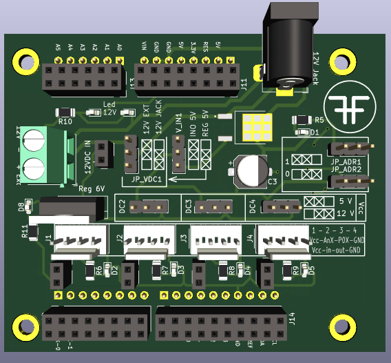
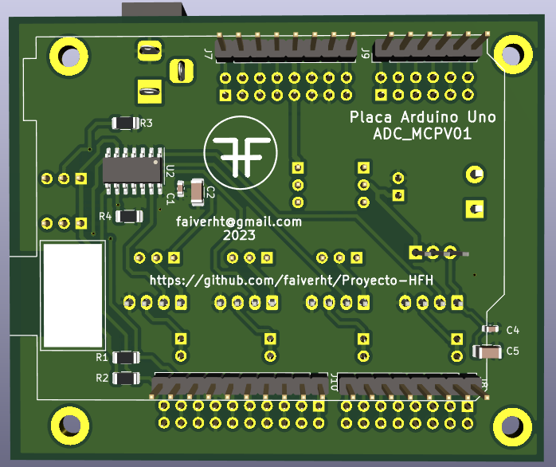
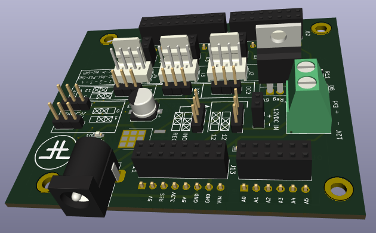
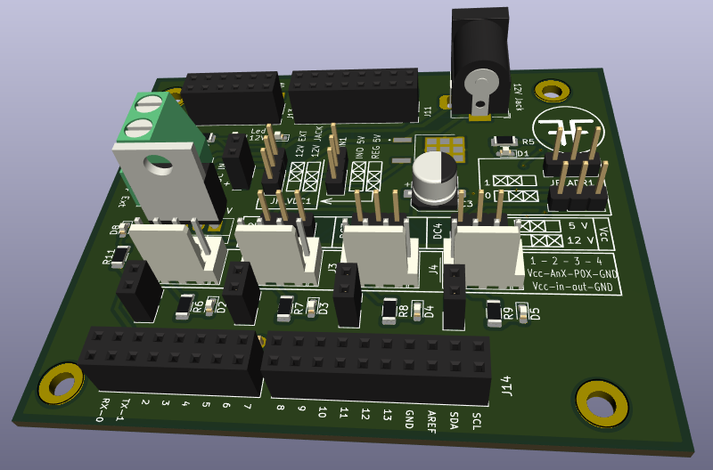
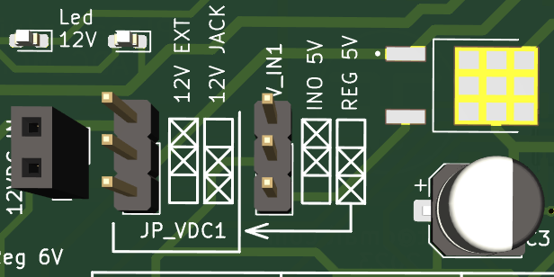
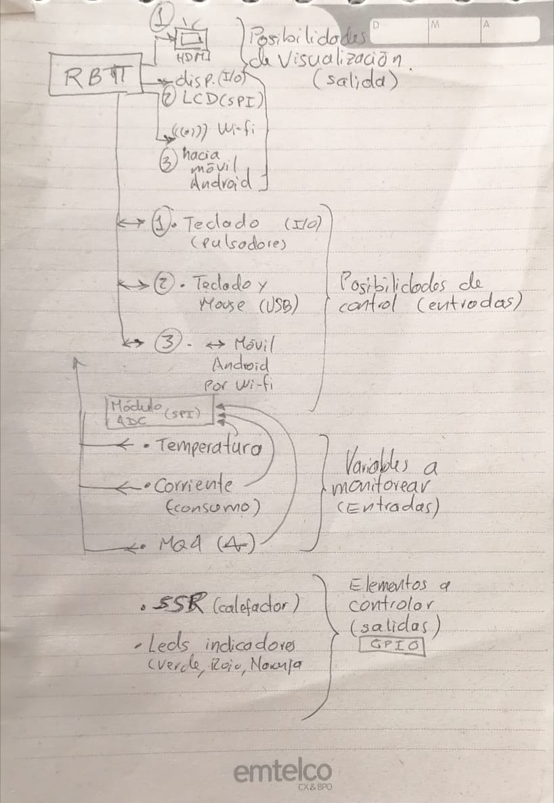

# Proyecto-HFH

## Avance placa primera versión:
Tarjeta de expansión de puertos análogos con conversor análogo digital MCP3424 (4 canales de 18 bits, PGA:1, 2, 4, 8), comunicación I2C dirección I2C (default): 1101

Alimentación de voltaje configurable:
1 - Desde la placa arduino Uno 5V (Jumper JP_VDC1 cualquiera o sin conexión y jumper V_IN1 en posición 'INO 5V')
2 - Desde fuente externa mediante Jack 12V (Jumper JP_VDC1  en posición '12V JACK' y jumper V_IN1 en posición 'REG 5V')
3 - Desde fuente externa mediante bornera 12V (Jumper JP_VDC1  en posición '12V EXT' y jumper V_IN1 en posición 'REG 5V')

## Frontal

## Trasera

## Otras

## Configuración de Jumpers para fuente de alimetación

Proyecto de monitoreo y control con Arduino y/o Raspberry Pi y/o PC (Win - Linux)

