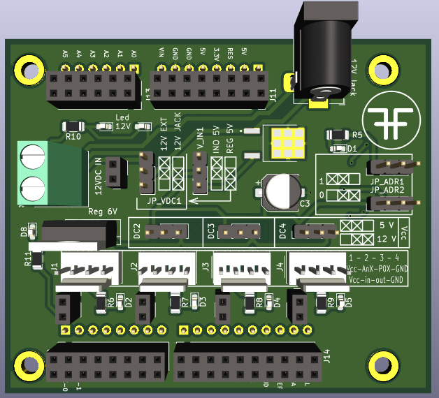

# Proyecto-HFH

## Avance placa primera versión:
Tarjeta de expansión de puertos análogos con conversor análogo digital MCP3424 (4 canales de 18 bits, PGA:1, 2, 4, 8), comunicación I2C dirección I2C (default): 1101

## Frontal

## Trasera

## Otras

## Terminado

## Configuración de Jumpers para fuente de alimetación

Alimentación de voltaje configurable:

1 - Desde la placa arduino Uno 5V (Jumper JP_VDC1 cualquiera o sin conexión y jumper V_IN1 en posición 'INO 5V')

2 - Desde fuente externa mediante Jack 12V (Jumper JP_VDC1  en posición '12V JACK' y jumper V_IN1 en posición 'REG 5V')

3 - Desde fuente externa mediante bornera 12V (Jumper JP_VDC1  en posición '12V EXT' y jumper V_IN1 en posición 'REG 5V')

Adicionalmente los conectores J2, J3 y J4 tienen alimentación configurable de 5V o 12V según posición de los jumpers DC2, DC3 y DC4

**Nota:**

El conector J1 se utiliza exclusivamente para sensor de entrada con alimentación de 6V

## Tarjeta de expansión terminada y en funcionamiento
EL código de prueba para Arduino se encuentran disponibles en /Arduino/Code pruebas de este mismo repositorio

Arduino y tarjeta de expansión

Montajes

Prueba de montaje y adquisición con sensor de gas MQ4

## Proyecto de monitoreo y control con Arduino y/o Raspberry Pi y/o PC (Win - Linux)

